# infrared & visible Aerial photography
!

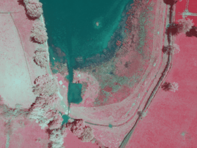

# General information
* Author : Balthazar Neveu , Alain Neveu
* Testers: [Pépin Hugonnot](https://www.pepin-hugonnot.fr/vincent-hugonnot-florine-pepin-auvergne_fr.html) : Florine Pépin 


# Quick start guide

## Set up

*For practical reasons*, only **windows is supported** as of now.
* install [Anaconda](https://www.anaconda.com/products/individual) with all default options. [Anaconda for windows, python 3.9](https://repo.anaconda.com/archive/Anaconda3-2021.11-Windows-x86_64.exe)
* [install.bat](install.bat) will set up the right python environment for you.
* you have to install [raw therapee](https://www.rawtherapee.com) software at the default windows location.

Download our [sample folder](https://drive.google.com/drive/folders/1khi0WdWyZ6H7Z7Lc5Q_i-Mm0Xq2sgpd1?usp=sharing)

## Overview
* Drone visible camera (DJI Mavic Air 2) is used to shoots RAW images
* An action camera with a wide FOV (SJCAM M20) which IR filter has been removed is attached under the drone.


* Before flying a temporal synchronization procedure has to be performed to sync the 2 cameras clocks.
* It consists in making the drone spin above a QR code (Aruco) chart. Or rotating the QR code. **Synchronization is key**

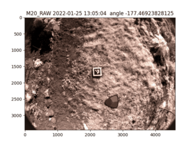 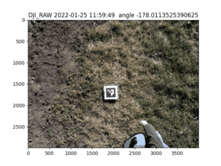

* Then the recommended way to capture your data is to fly with both cameras shooting in timelapse modes straight away. 
* Do not kill the timelapse after the synchro phase! keep on flying after synchronization

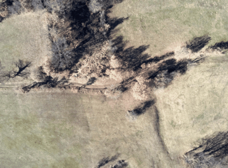 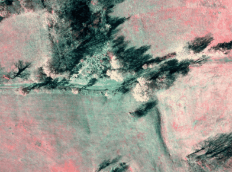


## **Tutorial** : Step by step processing 
* Once finished, offload your SD cards from IR & Visible cameras into the same folder:
  * In `AerialPhotography` where you put all pictures from the flight phase (*the folder name can be changed in the configuration excel*) 
  * In `Synchro` folder where you put all picture from the synchronization phase
* Create configuration file ( **.xlsx** or **.json**)
  * an excel based on the provided template [Templates/config.xlsx](./Templates/config.xlsx), fill mandatory information.
  * another option is to create a json configuration from the following template [Templates/config.json](./Templates/config.json). 
* double click on `synchro.bat` and select the `Synchro` folder


### JSON configuration approach

* You can use the `input` key (or `rootdir`) to provide a direct link to a specific folder (that would allow you to store all configurations at a unique place... including keeping your projects configurations under git revision).
* Regexp use are suggested in `visible` or `nir` keys to search the images. Please not that this way you can use 2 different folders for NIR and visible images.
```
{
  "synchro":"Synchro/synchro.npy",
  "output": "ImgIRdrone",
  "visible": "AerialPhotography/*.DNG",
  "nir": "AerialPhotography/*.RAW",
  "visible_timelapse": 2.0,
  "nir_timelapse": 3.0,
}
```
* `synchro` field  links to the synchronization file obtained when running `synchro.bat` (double click on `synchro.bat` and select the `Synchro` folder)
* optional fields `synchro_deltatime`, `synchro_date`, `coord_GPS_take_off` exists to override synchronization parameters.


### Excel configuration approach
* There are some fields where, you will need synchronization info so everything runs correctly.

here you have to copy/paste into the excel 
  * `3894.74`  = delta time.
  * `25/01/2022 11:59:49` = date
  * `N 45.16954 E 3.40005` = Coord GPS Take Off


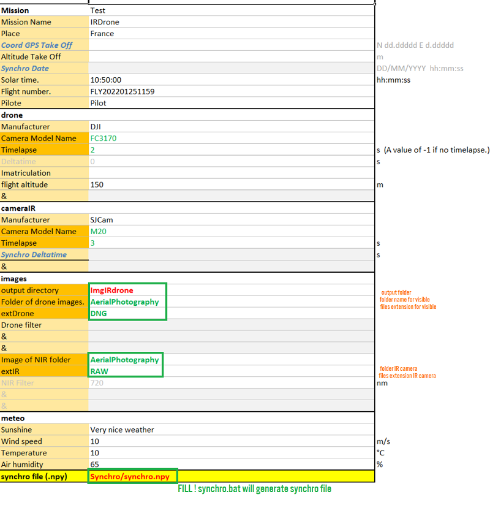


* Now you're ready to process your images. Double click on `run.bat` and select the configuration file (either .json or .xlsx). 
* Check the altitude profile displayed.


* Confirm you want to run processing on your images. Then be very patient, your files will be processed and stored in the `ImgIRdrone` folder.

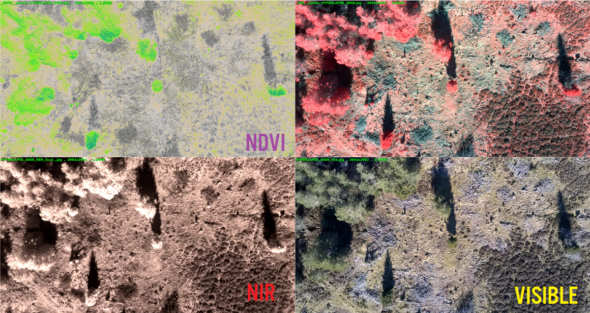

* Keep in mind that things are not perfect and there can sometimes be failures. If there's a picture which is very important, you are encouraged to re-run the processing with a manual option to assist the alignment (*next to the processed image, you can find a .bat dedicated to reprocessing your image with manual assistance : example `HYPERLAPSE_0008_REDO.bat`*). 
  * On the left, you can see that the red image has to be shifted to the left side to match the blue image. 
  * Use the yaw slider to align blue and green, see what happens on the right side? the overlap is correct!
  * then press `Q` to quit the GUI
  * process will continue the automatic processing. You have helped the initialization manually that way.

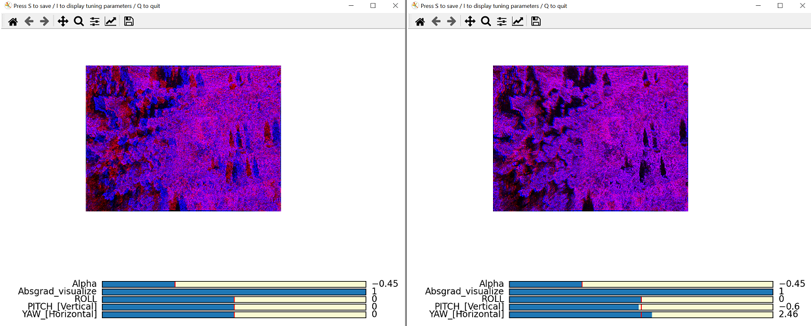

* Original metadata from the DJI drone are copied into the output file therefore these images are ready to be re-used in thirdparty software. For instance, creating a map is possible in Pix4DField in case you own a license *(I used the Trial version which is available for 15days)*
  * When launching Pix4DFields, the DJI camera won't be supported by default. You need to import a [custom camera file](https://support.pix4d.com/hc/en-us/articles/360035481811-What-to-do-when-a-camera-is-not-supported-in-Pix4Dfields).
  * Luckily, we created one for the DJI Mavic Air 2, see [Pix4DFields_custom_camera](Pix4DFields_custom_camera)


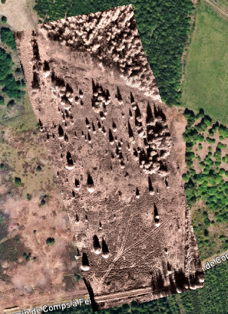

----------------------------------------
## Synchronization

* Aruco (=QR code) chart can be downloaded [here](https://drive.google.com/file/d/1rMB6LjY2Mi3gQDq5Mr6PrtMRRrahtkRC/view?usp=sharing) and has to be printed to A4 or A3 paper
* [full procedure description](https://drive.google.com/drive/folders/1Uk-eWBwteD2reOCdT0kngCWgcddz4C5s?usp=sharing) is available here.
* Copy the selected synchronization images into a "Synchro" folder -> visible & NIR images (expected .RAW and .DNG files by default).
* Double click on [synchro.bat](synchro.bat). *(Advanced users can use CLI obviously in case of other images format)* 
* Copy paste the delay result to your configuration excel in  `cameraIR` / `deltatime` . You can then close the window.
* Sample synchro data can be downloaded from [here](https://drive.google.com/drive/folders/10SCdV_wb57L6ODKlqpWORkE1B0559aUL?usp=sharing) 

## Alignment and Fusion
* Data can be processed by double cliking on `run.bat`. This will use [run.py](`run.py`) to select a given excel file. Advanced users can also use command line interface [automatic_registration.py](automatic_registration.py) 


## Exploiting data in third-party software
* Putting these data in [Pix4DFields](https://www.pix4d.com/product/pix4dfields) is possible
* Putting a timelapse into a panorama stitching software like [Hugin](http://hugin.sourceforge.net/) allows to stictch these images.
* Putting a timelapse into [VisualSFM](http://ccwu.me/vsfm/) allows to create a 3D map out of these images 
  just like you'd do with your drone images


----------------------------------------
# Details on processing
## Data processing description
## Pre-processing
  * SJCam M20 .RAW files are first converted to DNG using the following program [sjcam_raw2dng](https://github.com/yanburman/sjcam_raw2dng)
  * SJCAM .DNG & DJI .DNG files are processed using Raw Therapee to **linear demosaicked RGB 16bits** TIF files.
  * Lens Shading is automatically corrected while loading the TIF files.
## Alignment


* We first undistort the DJI visible image and undisort the infrared fisheye. In case of wind, the misalignment between both cameras can be of up to 20°s. 
  Roll of the drone leads to camera yaw, Pitch of the drone leads to camera pitch. Camera roll misalignment is usually zero because of the gimbal lock when the camera points towards the ground. 
  Hopefully, the fisheye has a much wider field of view than the DJI visible camera, therefore we're able to align the NIR image onto the visible image.
* Alignment is first performed by a "coarse alignment" to compensate coarsely camera misalignment yaw (well approximated by an horizontal translation)
  and camera misalignment pitch (well approximated by a vertical translation). 
  * We first undistort the SJcam NIR fisheye and match magnification factor with the DJI camera.
    The virtual NIR undistorted camera has the same focal length as the DJI camera but a much wider field of view. 
    If there's no misalignment, the center window of the SJcam image shall overlap the visible image
  * The first step of the coarse search is performed at very low resolution first
    * with a brute force approach (searching for the X Y tranlation which minimizes a certain cost function between the visible image and a moving window in the NIR image)
    * The translation approximates the underlying yaw/pitch camera rotation which we can simply recover. It allows to warp the NIR image onto a finer scale.
* Alignment refinement is then performed on the coarsely aligned NIR image. 
  * A pyramidal approach is chosen.
  * At each level of the pyramid, we estimate a vector field of displacements (split the images into 5x5 patches for instance and search for the best displacement)
  * This local vector field is sort of regularized by a global motion model fit (homography) which allows to refine the yaw, pitch & roll angles.
  * When going to  a finer scale, we warp the image according to the global homography estimated at the previous level. This allows to reduce the search horizon.
  
## Post-processing
* Once the alignment model has been found, the NIR image is warped (only once) on the Visible image.
* Several color representation of the merge of NIR & Visible images can be computed such as NDVI or VIR.
* **Important note : color calibration shall be tackled at some point**, it may not be too difficult though.


  
## Semi-automatic fallback
While reviewing the data, there may still be some issues in alignment.
Unfortunately multispectral alignment is an ill-posed problem and sometimes the automatic system fails.
There's still a way to save your images.
  * There's a .bat file next to the results which allows you to re-run manually the images which failed. 
  * It will open a GUI where you can simply pick the yaw, pitch & roll
    to replace the coarse alignment & make the images overlap. 
    This will guide the automatic system to a manual initial guess which will eventually lead to an accurate automatic alignment.
  * If synchronization does not seem correct (or there was big wind), you can try your luck with another image by uncommenting the right line in the .bat .

-------------------------
# References
* Normalized Total Gradient: A New Measure for Multispectral Image Registration *Shu-Jie Chen and Hui-Liang* [Paper](https://arxiv.org/pdf/1702.04562.pdf)
* Robust multi-sensor image alignment, *Michal Irani and P Anandan* [Paper](https://www.cs.ccu.edu.tw/~tsaic/teaching/spring2005_grad/irani-iccv98.pdf)
* Burst photography for high dynamic range and low-light imaging on mobile cameras, *Samuel W. Hasinoff, Dillon Sharlet, Ryan Geiss, Andrew Adams, Jonathan T. Barron, Florian Kainz, Jiawen Chen, and Marc Levoy*,  [Supplemental Material](https://static.googleusercontent.com/media/hdrplusdata.org/fr//hdrplus_supp.pdf)
* Registration of visible and near infrared unmanned aerial vehicle images based on Fourier-Mellin transform *Gilles Rabatel, S. Labbe* [Paper](https://hal.archives-ouvertes.fr/hal-01684135/document)
* Two-step multi-spectral registration via key-point detector and gradient similarity. Application to agronomic scenes for proxy-sensing *Jehan-Antoine Vayssade, Gawain Jones, Jean-Noël Paoli, Christelle Gée* [paper](https://hal-agrosup-dijon.archives-ouvertes.fr/hal-02499730)


## Technical notes
* Please note that feature based method did not work correctly and generally speaking. Using Phase correlation/Fourier (including Melin Fourier) didn't bring fully satisfying results either for the coarse approach.
* The Normalized Total Gradient was retained as a cost function. Motion regularization is not implemented here and some form of regularization shall be implemented for the local estimation in the near future.
----------------------------------
# Camera calibration
* Officially supported cameras (camera calibrations are pre-stored in the calibration/mycamera folder)
  * DJI RAW
  * SJcam M20 RAW


## Content
2 cameras are used:
* drone visible camera
* IR camera

`Camera type`: type is located in th exif, open file details and search camera model
`Timelapse`: provides the interval between each photo in seconds
`deltatime`: provides an offset between the two cameras timestamps.
In the sample folder, you'll find image examples, deltatime is ~ 15 seconds.


------
* **Refer to the [calibration documents](https://drive.google.com/drive/folders/1wm4mNICmo9koOwB6QRJn871etPJu7mk0?usp=sharing)**


## Supporting other cameras
Here are a few words on how to re-calibrate new cameras.  Beware that the code won't run easily for new formats as there may be a bunch of things to modify to support new cameras/drones. Feel free to reach out to balthazarneveu@gmail.com in case you're interested in using this project.

### Geometric calibrations
* when using a new camera:
  * to get a planar checkerboard, either print or display on your computer screen  [Generator "8x11"](https://calib.io/pages/camera-calibration-pattern-generator)
  * shoot about 30 images of the checkerboard in various camera orientations (refer to [openCV Zhang's camera calibration](https://docs.opencv.org/master/dc/dbb/tutorial_py_calibration.html)
  * put all images in `calibration/mynewcamera`
  * `calibnewcam = irdrone.utils.cameracalibration(camera="mynewcamera", checkerboardsize=(10,7))` will take care of camera calibration
* camera calibration is located  [irdrone.calibration](irdrone/cameracalibration.py)  for more details to calibrate your new camera


### Shading calibration
The [shading calibration script](irdrone/cameravignetting.py) is not publicly supported.
A white chart shall be shot to calibrate lens shading (luminance and color).

.

To calibrate the radial shading of a fisheye, we use polar projections (on the left) and extract radial profiles.  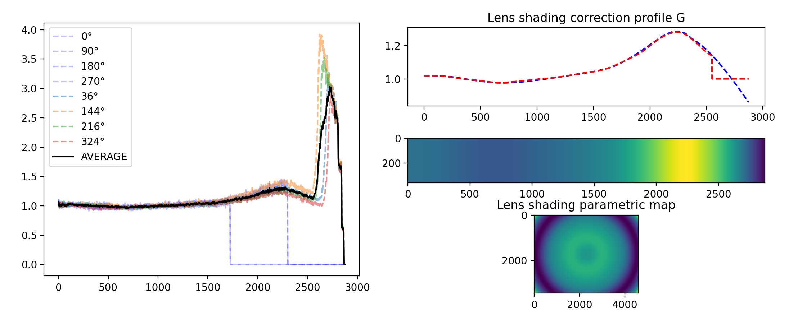

DJI Mavic Air 2 has some color shading (seen as a pink spot in the middle) which can't be fully compensated for. We compensate the slight luminance lens shading though (**on the left, corners aren't darker**).


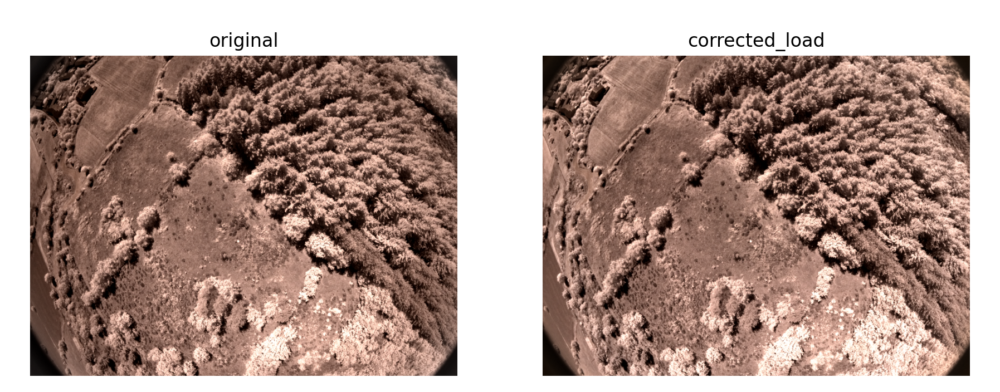

-------------------------
# Testing
```pytest test.py```

-------------------------
# Image processing and visualization features
With this project comes a few useful tool, especially the interactive image processing GUI which makes complex pipelines easily tunable.

## Demo content
Run [demo/demo.py](demo/demo.py) to test the image processing features.

### I/O management
* [irdrone.process](irdrone/process.py) contains helpers
  * load images from disk
  * compare images in a side by side or grid fashion
  
```
import irdrone.process as pr
import irdrone.utils   as ut
pr.show(
    [
        [(ut.testimage(xsize=200, ysize=200, sat=sat ), "color rectangle %.1f"%sat) for sat in [0.1, 0.5]],
        [(ut.testimage(xsize=300, ysize=200, sat=sat), "wide %.1f"%sat) for sat in [0.3, 0.5, 1.]]
    ],
    suptitle="Comparison grid"
)
```


# Image processing pipeline

[irdrone.imagepipe.Imagepipe](irdrone/imagepipe.py) class is designed to build a simple image processing pipeline
* multiple inputs support
* configured through parameters which can be tuned with GUI sliders
* use the `.gui()` method to launch interactive tuning
* when the GUI is launched, you can use 
    * `S` to save the current image at full resolution
    * `I` to print the current tuning parameters values
    * `Q` to close the window
    * `R` to reset the parameters

Simple language is used to describe the sequence of processings.
### Example
```
imgl = [utils.testimage(xsize=720, ysize=720),]
ipBasicLinPipe = imagepipe.ImagePipe(
    imgl,
    sliders=[imagepipe.BRIGHTNESS, imagepipe.WB, imagepipe.GAMMA],
).gui()
```

Will create an image processing pipeline where first, 
* all channels can first be amplified through the brightness slider.
* then white balance can be applied (separate multiplications on blue and red channels)
* and finally a gamma tone curve is applied


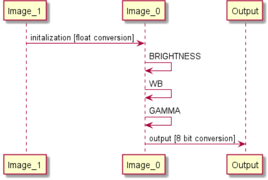


### Multi-image processing
```
TRANSLATION2 = Translation("T_IMAGE2", slidersName=["TX im2", "TY im2"], inputs=[2,], outputs=[2,], vrange=(-50.,50.,0.))
imgl = [utils.testimage(xsize=720, ysize=720, sat=sat) for sat in [1., 0.]]
ip = ImagePipe(imgl, sliders=[WB, TRANSLATION2, ALPHA, GAMMA]).gui()
```
* `imagelist[0]` is used for recursive processing.
* Take a careful look at the instanciation of `TRANSLATION2` , `inputs=[2,], outputs=[2,]` are given in order to select 
  which images to apply the processingBlock to and where to redirect the output.
  

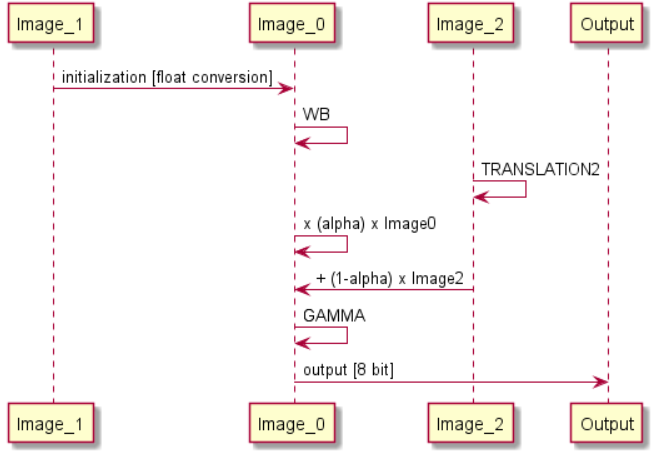


-------------------------
# Legacy - classic registration approach
## Image registration code
* Images from the drone are nearly distorsion-less
* Images from the fisheye IR camera have a much wider field of view and distorsions

Image registration works in the following manner:
* undistort IR image
* computes feature (*SIFT*) points on 2 thumbnails (800x600) of visible & undistorted IR image in grey levels
* matches features points (*Flann*)
* estimates homography between the two set of matched points
* allows for full resolution (not thumbnail) warp of the IR image onto the visible full resolution image.

## What changed?
Unfortunately this simple approach did not work correctly for multispectral alignment.
We switched to raw format to be able to use the linearity for correct IR - Visible color comparisons.